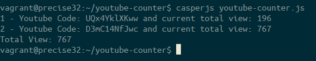

# YouTube Counter

Simple CasperJS script to count total view of YouTube videos. I made this script to help my colleague generate a report for client.

# Requirements

1. [PhantomJS](http://phantomjs.org/)
2. [CasperJS](http://casperjs.org/)

# How to use

Put the list of YouTube embed code to 'code' array. The script will automatically loop through the code and calculate total view.

# Process

1. Loop through the YouTube 'code' array.
2. Append the code to YouTube URL.
3. Visit the URL and get the number of view from 'watch-view-count' element.
4. Add the number of view to 'totalView'.
5. Output the 'totalView'.

# Screenshot

